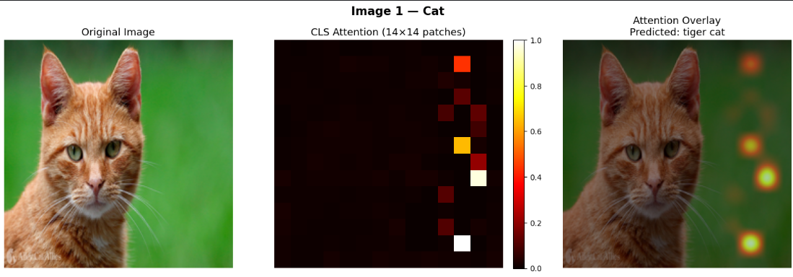
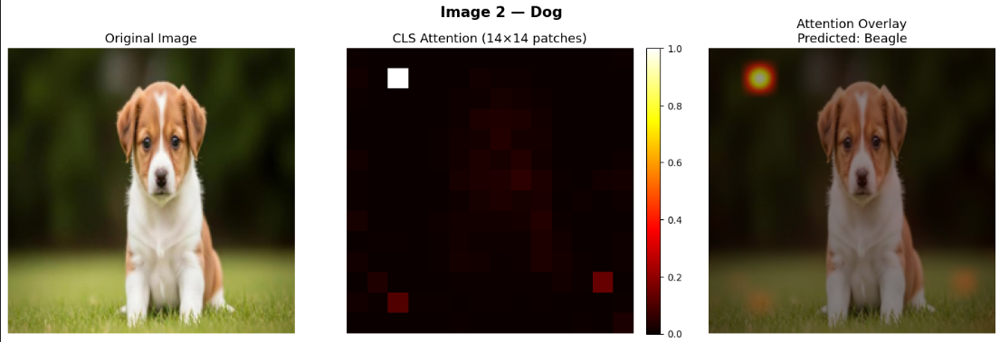
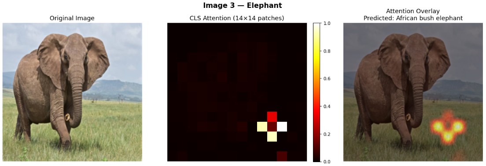
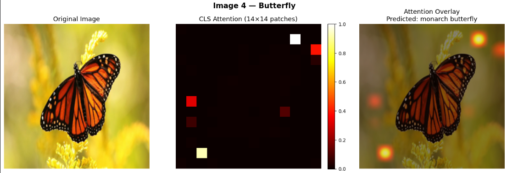
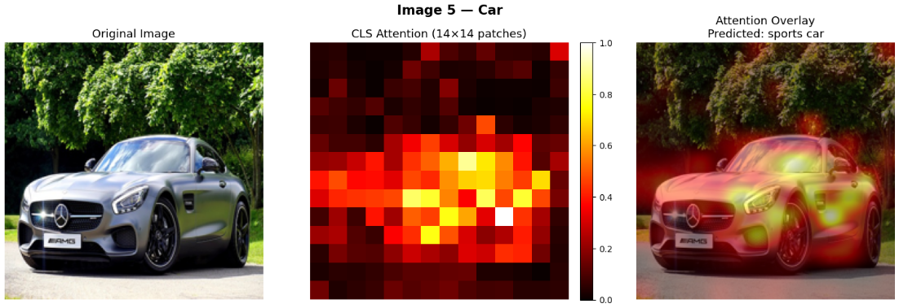

# Attention

I've written a blog explaining the attention mechanism and the 
architecture of a Transformer based on my own understanding, you
can find it on my [personal website](https://anushka-priya.github.io/): [here](https://anushka-priya.github.io/blog/attention-is-all-you-need/).

# ViT Attention Map Visualizations

I've used a pretrained **ViT-B/16** (Vision Transformer) from the 
`timm` library to visualize attention maps on 5 images of my choice.

The key idea was to extract the attention weights from the **last 
transformer block**, specifically how much the **[CLS] token** 
attends to each of the 196 image patches. This tells us which 
parts of the image the model focuses on when making a 
classification decision.

## Results

### Image 1 — Cat (Predicted: tiger cat)

Attention is scattered across the frame. Since the cat 
fills most of the image, the model struggles to isolate 
and attention spreads across the subject and background.

### Image 2 — Dog (Predicted: Beagle)

Attention concentrates at the top corner which is an 
interesting case where the model predicts the breed
despite attention not strongly focusing on the dog 
itself. This highlights that attention maps don't 
always intuitively explain predictions.

### Image 3 — Elephant (Predicted: African bush elephant)

The attention concentrates on a small cluster of patches 
in the lower centre-right of the image. The face, trunk 
and body which are the most visually prominent parts receive 
relatively little attention. Despite this, it 
correctly predicts "African bush elephant".

### Image 4 — Butterfly (Predicted: monarch butterfly)

Attention is distributed across multiple patches, both 
on the wings and on the surrounding flowers. The 
butterfly's distinct orange and black pattern spans 
many patches, so the model attends to multiple 
regions simultaneously.

### Image 5 — Car (Predicted: sports car)

The strongest result wherein attention broadly covers the 
entire car and makes the correct classification as well.

