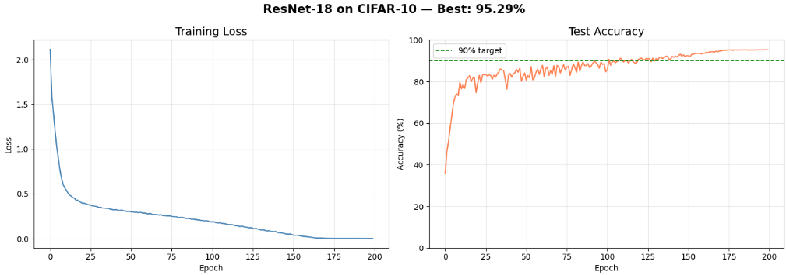

# ResNet-18 on CIFAR-10

## ResNet

ResNet (Residual Network) addresses the **degradation problem** observed in
deep neural networks wherein networks with increasing depth exhibit higher
training error than networks with comparatively less layers.

The solution that ResNets provide is that rather than expecting
stacked layers to directly approximate a desired underlying mapping H(x),
ResNet lets these layers fit a **residual mapping** F(x) = H(x) − x.
The original mapping is then recast as: y = F(x) + x.

This is achieved through **shortcut connections** or residual connections
which perform identity mapping, with their outputs added element-wise to the
outputs of the stacked layers. These shortcut connections add neither extra
parameters nor computational complexity, yet allow gradients to flow directly
backwards through the network. This enables deeper architectures to train
without compromising on the accuracy.

## ResNet-18 Architecture

ResNet-18 consists of 18 layers:
- 1 initial convolution layer (stem)
- 16 convolution layers forming **8 residual blocks**
- 1 fully connected layer

## CIFAR-10 Dataset

The [CIFAR-10](https://cave.cs.toronto.edu/kriz/cifar.html) dataset consists of 60,000 32×32 colour images spanning
10 mutually exclusive classes, with 6,000 images per class:
- **50,000** training images
- **10,000** test images

Classes: airplane, automobile, bird, cat, deer, dog, frog, horse, ship, truck.

### Architectural Decisions
The following design choices are consistent with those adopted in the original
ResNet paper- [Deep Residual Learning for Image Recognition](https://arxiv.org/abs/1512.03385) (He et al., 2015):

- **Stem modification for CIFAR-10:** The original ImageNet architecture
employs a 7×7 convolution with stride=2 followed by max pooling, suited
for large 224×224 images. Since CIFAR-10 images are 32×32, this degree
of aggresive downsampling would reduce spatial resolution early on and
discard low-level features. Consistent with the paper's small-dataset
configurations, the stem uses a 3×3 convolution with stride=1 and no
max pooling, preserving the full 32×32 spatial resolution through the
initial layer.

- **Projection shortcuts (Option B):** Only in the case when
the dimensions of the input and output of a residual block differ,
a 1×1 convolution is applied via the shortcut connection to match
dimension. In all other cases, the shortcut connections are identity.
This corresponds to Option B as described in the original paper.

- **Batch Normalization:** As noted in the original paper, Batch
Normalization is applied after every convolution and before activation
throughout the network. Dropout is not used.

- **Global Average Pooling:** In place of large fully connected layers,
a global average pooling layer is used before the final classification.
This significantly reduces parameters while improving generalization.

## Training Setup

| Hyperparameter | Value |
|---|---|
| Optimizer | SGD |
| Momentum | 0.9 |
| Weight Decay | 5e-4 |
| Initial LR | 0.1 |
| Epochs | 200 |
| Batch Size | 128 |

## Results

| Metric | Value |
|---|---|
| Best Test Accuracy | **95.29%** |

## Training Curves

The training loss decreases smoothly over 200 epochs. Test
accuracy improves consistently, crossing 90% around epoch
120 and peaking at **95.29%**. This shows that the residual
learning framework successfully addresses the degradation problem and
yields accuracy gains from increased depth.

